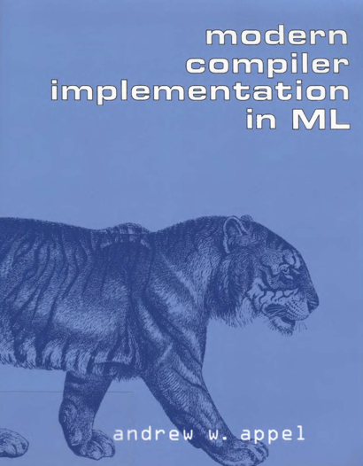

Reading and implementing the book [Modern Compiler Implementation in ML](https://www.amazon.com.br/Modern-Compiler-Implementation-Andrew-Appel/dp/0521607647) in Haskell.

I'm using the [IHaskell](https://github.com/gibiansky/IHaskell) kernel for Jupyter Notebook.

